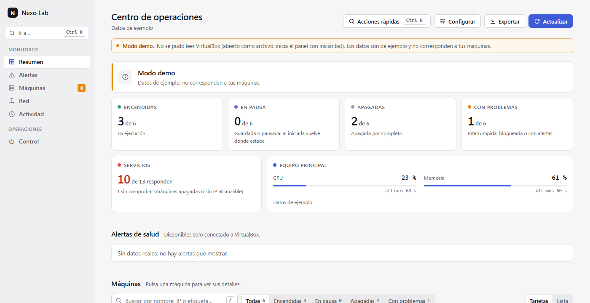
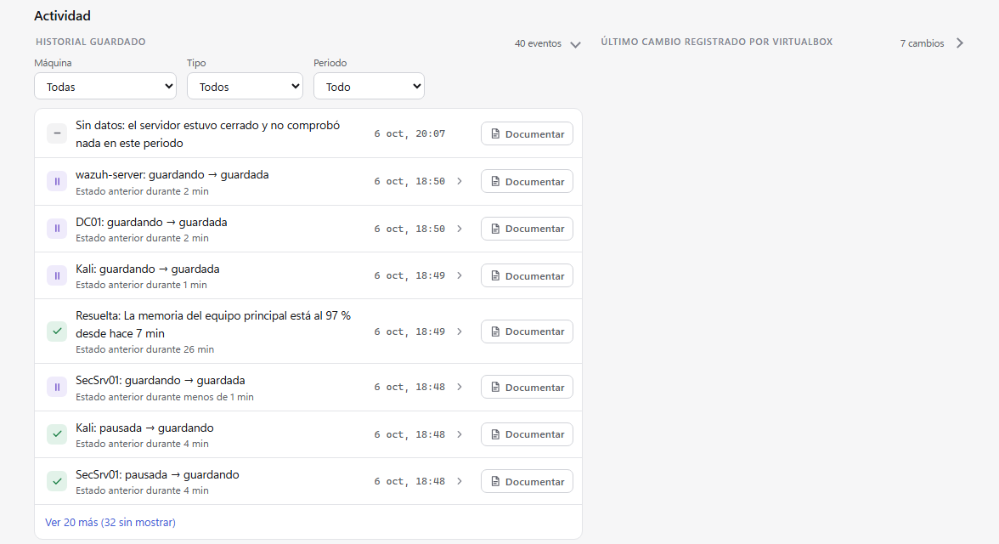
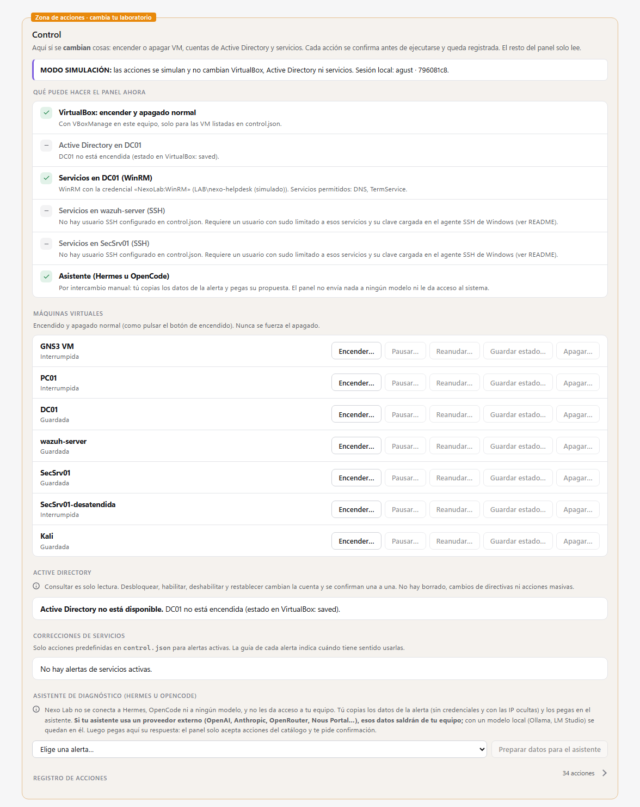

# Nexo Lab

Panel local para **ver y operar un laboratorio de máquinas virtuales de VirtualBox en Windows**: estado real de cada VM, comprobación de servicios, alertas con guías de diagnóstico, historial persistente y una sección de **Control** con acciones confirmadas y auditadas.

Lo construyó una persona que se forma en redes y ciberseguridad y tiene varias VM para practicar (controlador de dominio, servidor Wazuh, Kali, entre otras). Antes tenía que revisar VirtualBox, los servicios y los registros por separado; Nexo Lab los reúne en un solo lugar. **No es un producto:** es una herramienta de práctica, hecha con cuidado y con sus límites a la vista (ver [Estado y límites](#estado-y-límites)).



> La captura usa los datos de ejemplo del modo demo; no son máquinas reales.

## Contenido

- [Qué hace](#qué-hace)
- [Inicio rápido](#inicio-rápido)
- [Arquitectura](#arquitectura)
- [Modelo de seguridad](#modelo-de-seguridad)
- [Catálogo de acciones de Control](#catálogo-de-acciones-de-control)
- [Configuración](#configuración)
- [API local](#api-local)
- [Pruebas](#pruebas)
- [Estado y límites](#estado-y-límites)
- [Hoja de ruta](#hoja-de-ruta)
- [Proyecto hermano: analizador de alertas Wazuh](#proyecto-hermano-analizador-de-alertas-wazuh)
- [Cómo se construyó](#cómo-se-construyó)
- [Estructura del proyecto](#estructura-del-proyecto)
- [Licencia](#licencia)

## Qué hace

El proyecto tiene dos partes separadas a propósito: **monitorizar** (solo lectura) y **operar** (cambia el laboratorio).

### Monitorización · solo lectura

- **Estado real de cada VM**, leído con `VBoxManage`: encendida, en pausa, guardada, apagada o interrumpida; fecha del último cambio, vCPU, RAM y redes. Se actualiza cada 10 s.
- **Direcciones IP**: si la VM no la informa (Guest Additions), se busca por MAC en el DHCP de VirtualBox y en la tabla ARP.
- **Métricas en tiempo real** (cada segundo): CPU y memoria del equipo y de cada VM encendida, con gráficas con ejes y unidades.
- **Comprobación de servicios** (SSH, RDP, DNS, LDAP, web de Wazuh…): conexión TCP o petición HTTP/HTTPS sin credenciales, solo a los puertos listados y solo a IP privadas alcanzables. Distingue «la VM está encendida» de «el servicio responde».
- **Mapa de red** del laboratorio según los adaptadores de VirtualBox.

### Alertas y ayuda

- Cada alerta dice **qué se comprobó y cuándo**, con una severidad (Crítica, Advertencia, Información).
- **Guías de solución** por tipo de alerta: primero diagnóstico de solo lectura, después correcciones que haces tú, y un botón «Comprobar ahora».
- Alertas de salud: VM interrumpida, VM encendida sin IP, servicio sin respuesta (o con error 5xx), memoria o CPU del equipo sostenidas al 90 %, y error de configuración. Hay un margen de arranque de 120 s para no avisar de servicios que aún están iniciando.

### Historial

- **SQLite** local (`data/nexo-historial.db`): cambios de estado, servicios, alertas y alertas resueltas, más una muestra de CPU y memoria por minuto. Se conserva 30 días.
- Los periodos con el servidor cerrado se registran como **«Sin datos»**: no se inventa lo que pasó.
- **Tendencias** de 1 h, 24 h y 7 días por máquina.
- Cada cambio de estado nuevo indica si lo pidió el panel (acción, usuario y hora) o si no hay ninguna acción registrada.
- Las listas de Actividad y del registro de acciones son **desplegables** y cargan por partes («Ver 20 más»).

### Notas y reportes

- **Notas en Obsidian**: el botón «Documentar» prepara una nota Markdown con la evidencia observada. Guardar pide confirmación, muestra la ruta y **nunca sobrescribe**: si existe, crea «(2)».
- **Exportar reporte**, con opción de ocultar las IP.
- **Configuración desde el panel**, que guarda una copia del archivo anterior antes de cambiarlo.

### Control · cambia el laboratorio

Una zona aparte, marcada en naranja, con un **catálogo fijo de 12 acciones** (ver [la tabla](#catálogo-de-acciones-de-control)):

- Encender, pausar, reanudar, **guardar el estado** y apagar VM. El apagado es siempre normal (ACPI), nunca forzado, y el panel verifica el estado final en VirtualBox.
- Active Directory en el controlador de dominio: consultar, desbloquear, habilitar, deshabilitar y restablecer con contraseña temporal.
- Reiniciar servicios predefinidos por WinRM o SSH.
- **Asistente de diagnóstico por intercambio manual**: el panel genera un texto con los datos de una alerta (IP ocultas, sin credenciales), tú lo pegas en el asistente que uses y pegas su propuesta de vuelta. El panel la valida contra el catálogo antes de mostrarla. No se conecta a ningún modelo.

### Interfaz

Diseño inspirado en herramientas de operaciones (Linear, Raycast, Grafana): paleta neutra con un acento, colores de estado consistentes, tema claro y oscuro, panel lateral de detalle de máquina y adaptación a móvil y teclado. `Ctrl + K` abre las **acciones rápidas** (solo navegación; nunca ejecuta acciones de Control).

| | |
|---|---|
|  |  |
| Actividad con bloques desplegables | Control en modo simulación |

## Inicio rápido

**Requisitos:** Windows 10/11, Python 3 (probado con 3.11, sin paquetes extra) y VirtualBox. Si `VBoxManage.exe` no está en la ruta habitual, define la variable `NEXO_VBOXMANAGE`.

```bash
python server.py 8770          # o doble clic en iniciar.bat
```

Abre <http://127.0.0.1:8770/index.html>.

### Probar sin tocar nada: modo simulación

```bash
iniciar-simulacion.bat         # o: set NEXO_SIMULAR=1 && python server.py 8772
```

En simulación la lectura de VirtualBox sigue siendo real, pero **las acciones de Control se simulan**: no cambian VirtualBox, Active Directory ni servicios. La interfaz lo muestra con el aviso «MODO SIMULACIÓN». Es la forma recomendada de conocer el panel.

> Si abres `index.html` con doble clic (sin servidor), el panel muestra datos de ejemplo y lo indica claramente.
>
> Un servidor recién arrancado tarda hasta unos 25 s en la primera lectura; si ves «Modo demo», espera y recarga con `Ctrl + F5`. `iniciar.bat` no reinicia un servidor que ya está en el puerto 8770: ciérralo antes si quieres cargar código nuevo.

## Arquitectura

```
Navegador (127.0.0.1)
   │  HTML + JS sin frameworks (index.html, js/)
   ▼
server.py  ──── solo lectura ───►  VBoxManage (list, showvminfo, guestproperty)
(HTTP local)                        comprobaciones TCP/HTTP, métricas de Windows
   │                                SQLite (data/nexo-historial.db)
   │                                Obsidian (solo notas nuevas, con confirmación)
   │
   └─ /api/control, /api/ad, /api/asistente
         ▼
      control.py ── cambia el laboratorio ─►  VBoxManage (start/pause/resume/savestate/acpipowerbutton)
      catálogo fijo · tickets                 ops/ad.ps1     (Active Directory, LDAP firmado y cifrado)
      auditoría (jsonl)                       ops/winsvc.ps1 (servicios de Windows por WinRM)
                                              ssh            (servicios Linux, sudo limitado)
```

`server.py` **no ejecuta acciones**: recibe las peticiones de Control, comprueba origen, token y ticket, y las delega en `control.py`. Python 3 sin dependencias; interfaz en JavaScript sin frameworks.

## Modelo de seguridad

Las acciones son lo delicado, así que el diseño parte de **no confiar en nadie**, ni en la interfaz ni en un asistente:

- **Catálogo fijo.** Solo existen las acciones de la tabla. No hay ninguna que acepte comandos de texto, ni desde la interfaz ni desde un asistente.
- **Parámetros tipados.** Cada acción admite solo sus parámetros. Los servicios deben figurar en `control.json` para esa VM; las cuentas y nombres se validan con expresiones estrictas; los programas se lanzan con argumentos separados, sin shell.
- **Objetivo verificado.** La VM debe existir en VirtualBox y estar en la lista de `control.json`. La acción debe corresponder al estado actual (no se enciende una VM encendida). Se **revalida al ejecutar**, porque el estado pudo cambiar tras la confirmación.
- **Confirmación en dos pasos.** «Preparar» devuelve el plan exacto y un **ticket de un solo uso que caduca a los 120 s**; «ejecutar» exige ese ticket. Las cuentas privilegiadas de AD obligan a escribir su nombre; `Administrator` y `krbtgt` están bloqueadas.
- **Peticiones protegidas.** El servidor solo escucha en `127.0.0.1`, comprueba la cabecera `Host` (contra DNS rebinding), exige mismo `Origin`, contenido JSON, un token que solo conoce la página servida por él y, si el navegador informa `Sec-Fetch-Site`, que sea del mismo sitio. Cuerpo máximo de 256 KB.
- **Credenciales fuera de los archivos.** Viven en el Administrador de credenciales de Windows; el panel solo comprueba que existan. Nunca se escriben en `control.json`, registros ni argumentos de procesos.
- **Auditoría.** `data/acciones-auditoria.jsonl` registra usuario de Windows, sesión, acción, objetivo, origen (panel o asistente), hora y resultado. Nunca contraseñas ni secretos.
- **Superficie de archivos.** El servidor no sirve `data/`, `ops/`, `tests/`, ni archivos `.py`, `.db`, `.jsonl` ni la configuración local; responde 404.
- **Escrituras acotadas.** Fuera de `data/`, solo escribe notas nuevas en la bóveda de Obsidian configurada y `servicios.json` (con copia previa).

Las rutas de seguridad tienen pruebas automáticas (`tests/test_rutas.py`) que se comprobaron rompiendo la protección a propósito.

## Catálogo de acciones de Control

| Acción | Qué hace | Disponible cuando |
|---|---|---|
| `vm.start` | `VBoxManage startvm` | VM apagada, guardada o interrumpida |
| `vm.shutdown` | `controlvm … acpipowerbutton` (apagado normal, nunca forzado) | VM encendida |
| `vm.pause` | `controlvm … pause`: congela la VM en memoria | VM encendida |
| `vm.resume` | `controlvm … resume` | VM en pausa |
| `vm.savestate` | `controlvm … savestate`: escribe la RAM en disco | VM encendida o en pausa, con espacio en disco suficiente |
| `svc.recheck` | Repite la comprobación de servicios (**solo lectura**, sin confirmación) | Siempre |
| `svc.start`, `svc.restart` | Inicia o reinicia un servicio de la lista, por WinRM o SSH | Credencial o usuario SSH configurado |
| `ad.unlock`, `ad.enable`, `ad.disable`, `ad.reset_password` | Cuenta de Active Directory | Credencial configurada y cuenta dentro de las OU permitidas |

**Pausar, guardar estado o apagar** según el caso: guardar estado sobrevive a reiniciar el PC y ocupa en disco tanto como la RAM de la VM; pausar congela en memoria; el apagado normal es lo más limpio y el recomendado antes de cambiar la configuración o para un controlador de dominio.

## Configuración

| Archivo | Para qué |
|---|---|
| `servicios.json` | Grupos y etiquetas de cada VM, servicios esperados (`tcp`/`http`/`https`) y umbrales. Se aplica en la siguiente comprobación, sin reiniciar. |
| `control.json` | Máquinas del laboratorio sobre las que se puede actuar, servidor y OU permitidas de AD, y qué servicio corresponde a cada puerto. **Sin secretos.** Lo editas tú; ni el panel ni un asistente pueden cambiarlo. |
| `nexo.local.json` | Opcional: ruta de la bóveda de Obsidian y carpeta de notas (plantilla en `nexo.local.ejemplo.json`). |

Ajustes por defecto en `servicios.json`: tiempo límite de comprobación 1,5 s, aviso de memoria y CPU del equipo al 90 % sostenido 5 min, VM interrumpida tras 2 días, margen de arranque 120 s, registro cada 30 s y retención de 30 días.

**Credenciales de Control** (opcionales, para activar cada parte):

- Active Directory: cuenta **delegada, no Domain Admin**, guardada con `cmdkey /generic:NexoLab:AD …` y las OU permitidas en `control.json`.
- Servicios por WinRM: credencial `NexoLab:WinRM`. Requiere que el equipo confíe en el destino; limita `TrustedHosts` a la IP del servidor en vez de `*`.
- Servicios Linux por SSH: usuario con `sudo` limitado a esos servicios y su clave cargada en el agente SSH de Windows.

Los comandos exactos están en la [guía completa](docs/GUIA.md). Mientras falte una credencial, la función correspondiente aparece desactivada con el motivo; el resto del panel funciona igual.

Variables de entorno: `NEXO_SIMULAR=1` (modo simulación), `NEXO_VBOXMANAGE` (ruta de `VBoxManage.exe`).

## API local

Todo es local (`127.0.0.1`). Las rutas de Control exigen el token del panel, el mismo origen y JSON.

| Método y ruta | Qué devuelve o hace |
|---|---|
| `GET /api/estado` | Estado de VM, servicios, alertas y datos del equipo |
| `GET /api/metricas` | CPU y memoria en tiempo real |
| `GET /api/historial`, `/api/tendencias` | Eventos guardados y tendencias de 1 h, 24 h y 7 días |
| `GET /api/obsidian`, `POST /api/obsidian/plan`, `/guardar` | Estado de la bóveda y notas nuevas |
| `GET`/`POST /api/config` | Leer y guardar `servicios.json` (con copia previa) |
| `GET /api/control`, `/api/control/registro`, `/api/control/trabajo` | Qué puede hacer el panel, registro de acciones y progreso de una acción |
| `POST /api/control/preparar` | Valida una acción y devuelve el plan y un ticket |
| `POST /api/control/ejecutar` | Ejecuta con el ticket |
| `GET /api/ad/buscar`, `/api/ad/cuenta`, `POST /api/ad/probar` | Consultas de solo lectura y prueba de AD |
| `GET /api/asistente/paquete`, `POST /api/asistente/validar` | Texto para el asistente y validación de su propuesta |

## Pruebas

```bash
python -m unittest discover -s tests
```

**60 pruebas automáticas** (22 de Control, 19 de servicios y alertas, 19 de las rutas HTTP de seguridad). No necesitan VirtualBox ni red: usan VirtualBox, AD y servicios simulados. Cubren el catálogo y los parámetros, estados que no corresponden, tickets inventados, reutilizados o caducados, origen, token y host falsos, archivos privados, alertas, comprobación de red y de servicios, y el cálculo de espacio antes de guardar estado.

## Estado y límites

Dicho con honestidad:

- **Probado con VirtualBox real** (según el registro de auditoría): lectura de estados, encender, pausar y guardar estado. **Reanudar y apagar** solo se probaron en simulación.
- **Sin probar contra un dominio real:** las acciones de Active Directory, WinRM y SSH están implementadas y cubiertas con simulación, pero faltan credenciales y una cuenta de laboratorio sin importancia para la primera prueba. Úsalas primero con una cuenta sin importancia.
- **Problema conocido:** al encender una VM con un estado guardado grande, el panel cancela el comando a los 90 s y lo muestra como «error» **sin comprobar el estado real** en VirtualBox. Es probable que la VM sí haya arrancado.
- Al reiniciar el servidor se pierden los contadores de las alertas «sostenidas» de CPU y memoria; la hora desde la que está activa cada alerta se guarda pero aún no se muestra.
- Pausar o guardar el estado **no** genera alertas falsas: los servicios de una VM detenida se muestran «sin comprobar», con el motivo.
- Solo Windows (usa APIs de Windows para las métricas y el Administrador de credenciales), un usuario, solo VirtualBox.
- Que un servicio no responda no prueba que esté apagado: puede ser un filtro o un firewall. El panel lo dice así.

## Hoja de ruta

Ideas, no compromisos, ordenadas por valor:

1. Comprobar el estado real tras un tiempo de espera al encender (corrige el problema conocido).
2. Persistir los contadores sostenidos y mostrar «activa desde» en cada alerta.
3. Primera prueba real de AD, WinRM y SSH, y probar reanudar y apagar contra VirtualBox real.
4. **Escenarios**: por ejemplo «Práctica de AD», que enciende el controlador de dominio, espera su servicio y luego el resto.
5. Capturas (snapshots) con confirmación, con un aviso claro: restaurar un controlador de dominio puede provocar un retroceso de USN.
6. Notificaciones de Windows para alertas críticas y lectura de alertas de Wazuh en solo lectura.
7. Un asistente conectado por API (solo texto, sin herramientas, con el mismo validador del catálogo). Queda como decisión abierta porque enviaría datos del laboratorio a internet.

## Proyecto hermano: analizador de alertas Wazuh

Junto a Nexo Lab hay una segunda herramienta, [`wazuh-analizador`](https://github.com/agustinalpizar/wazuh-analizador) (repositorio aparte; **no está incluido aquí**): una página local y **educativa** que lee **una** alerta de Wazuh en JSON y separa lo que está literalmente en el evento (azul), lo derivado (gris) y las posibles interpretaciones, cada una con los campos en que se apoya (ámbar). Indica qué información falta y qué pasos seguros de solo lectura seguir.

No usa red (CSP `connect-src 'none'`), no guarda nada, inserta el contenido siempre como texto y no inventa campos ausentes. Se ejecuta con `python -m http.server 8765 --bind 127.0.0.1` y tiene sus propias pruebas (`node --test`). Las dos herramientas comparten el tema de lectura de alertas, pero **no están integradas**; unirlas es una idea de la hoja de ruta.

## Cómo se construyó

Con **Claude Code**: Claude Sonnet 5.5 para el trabajo diario (base, ajustes, pruebas, documentación) y Claude Opus 5.5 para las tareas más complejas (integración real con VirtualBox, historial, guías de solución, diseño de seguridad de Control y rediseño final).

El reparto fue deliberado: la persona define el problema y las reglas de seguridad, revisa cada resultado y lo prueba en su propio laboratorio; la IA convierte esas instrucciones en código. Los fallos que se detectaron por el camino (textos desactualizados que decían «solo lectura», pruebas rotas tras una refactorización, un servidor viejo que seguía en el puerto, un estado de VirtualBox desconocido, un falso «error» al encender) están anotados en la documentación y es parte del método: no dar por bueno lo que la IA genera sin comprobarlo.

## Estructura del proyecto

```
index.html             Página
css/styles.css         Estilos (claro y oscuro)
js/app.js              Interfaz y lectura de /api/estado
js/control.js          Interfaz de la sección Control
js/guias.js            Guías de solución por tipo de alerta
js/paleta.js           Acciones rápidas (Ctrl + K): solo navegación
js/data.js             Datos de ejemplo (modo demo)
server.py              Servidor local: lectura de VirtualBox, servicios, alertas, historial, Obsidian
control.py             Control: catálogo, validación, tickets, auditoría
control.json           Máquinas del laboratorio, AD y servicios corregibles (sin secretos)
servicios.json         Grupos, servicios esperados y umbrales
ops/ad.ps1             Active Directory (LDAP firmado y cifrado)
ops/winsvc.ps1         Servicios de Windows por WinRM
tests/                 60 pruebas automáticas
iniciar.bat            Arranque normal (puerto 8770)
iniciar-simulacion.bat Arranque en modo simulación (puerto 8772)
nexo.local.ejemplo.json  Plantilla de configuración local
DESIGN.md              Dirección de diseño
docs/GUIA.md           Guía completa: configuración, Control, Obsidian, credenciales
docs/capturas/         Capturas de este README
data/                  Historial y registro de acciones (local; no se sube a Git)
```

## Licencia

[MIT](LICENSE) © 2026 Agustín Alpízar Hernández.
